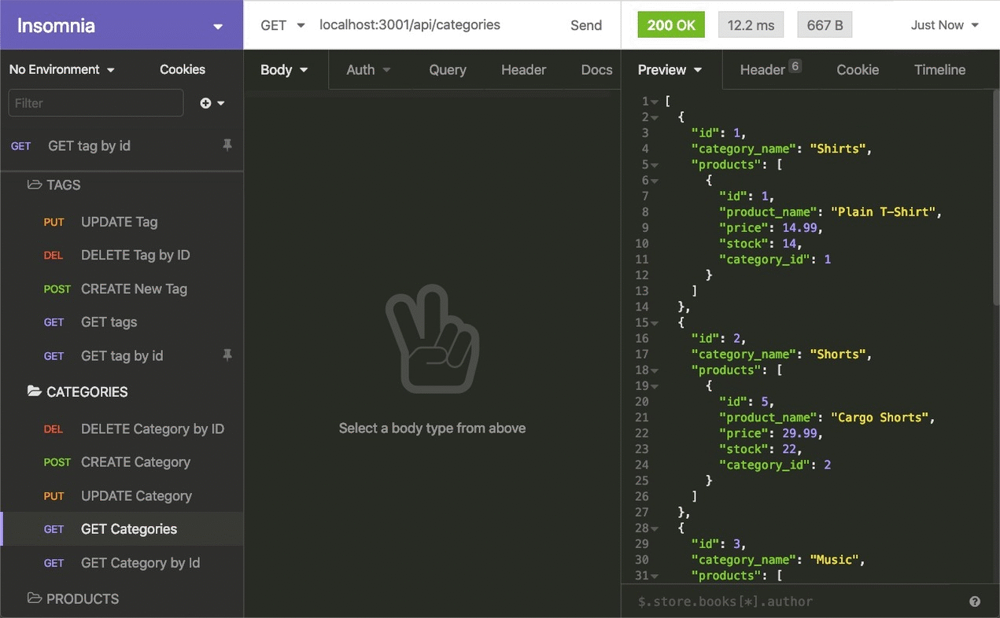

# Retail-Shop-Back-End  

  ## Description

  The back end for an e-commerce site. A working Express.js API is coupled with Sequelize to interact with a MySQL database.
  ## Table of Contents

  ***

  * [Installation](#installation)
  * [Usage](#usage)
  * [Screenshot](#screenshot)
  * [License](#license)
  * [Contributing](#contributing)
  * [Questions](#questions)

  ***

  ## Installation

  If you would prefer to run this page on your local machine simply clone the repo and run the command `npm i` in your terminal (right click and open integrated terminal). This will download all the dependencies you need to run the project. Alternatively, each dependancies can be installed one after another as:

  ```
  npm install mysql2
  npm install inquirer
  npm install console.table --save
  ```

  Next is to initiate the database by using the following code (each line is a command--press enter after each):
  ```
  mysql -u root -p
  <password>
  SOURCE db/tracker.sql;
  SOURCE db/seed.sql;
  exit
  ```

  Then use the following command to start this app in shell:

  ```
  node app.js
  ```

  See instruction video at
  [Retail-Shop-Back-End Instruction](https://drive.google.com/file/d/1r_QTvatfvBzdx9O4peyzioPRIwdILydC/view) <br>
  
  Available also at https://watch.screencastify.com/v/8lh3Ujn0YT4elGl9caij

  ## Usage

  <details>
  <summary>User Story</summary>

  ```
    AS A manager at an internet retail company
    I WANT a back end for my e-commerce website that uses the latest technologies
    SO THAT my company can compete with other e-commerce companies 
  ```

  </details>

  <details>
  <summary>Acceptance Criteria</summary>

    WHEN I add my database name, MySQL username, and MySQL password to an environment variable file <br>
    THEN I am able to connect to a database using Sequelize <br>
    WHEN I enter schema and seed commands <br>
    THEN a development database is created and is seeded with test data <br>
    WHEN I enter the command to invoke the application <br>
    THEN my server is started and the Sequelize models are synced to the MySQL database <br>

    WHEN I open API GET routes in Insomnia for categories, products, or tags <br>
    THEN the data for each of these routes is displayed in a formatted JSON <br>

    WHEN I test API POST, PUT, and DELETE routes in Insomnia <br>
    THEN I am able to successfully create, update, and delete data in my database <br>

  </details>

  <details>
  <summary>Database Models Requirements</summary>

  * `Category`

  * `id`

    * Integer.
  
    * Doesn't allow null values.
  
    * Set as primary key.
  
    * Uses auto increment.

  * `category_name`
  
    * String.
  
    * Doesn't allow null values.

* `Product`

  * `id`
  
    * Integer.
  
    * Doesn't allow null values.
  
    * Set as primary key.
  
    * Uses auto increment.

  * `product_name`
  
    * String.
  
    * Doesn't allow null values.

  * `price`
  
    * Decimal.
  
    * Doesn't allow null values.
  
    * Validates that the value is a decimal.

  * `stock`
  
    * Integer.
  
    * Doesn't allow null values.
  
    * Set a default value of `10`.
  
    * Validates that the value is numeric.

  * `category_id`
  
    * Integer.
  
    * References the `Category` model's `id`.

* `Tag`

  * `id`
  
    * Integer.
  
    * Doesn't allow null values.
  
    * Set as primary key.
  
    * Uses auto increment.

  * `tag_name`
  
    * String.

* `ProductTag`

  * `id`

    * Integer.

    * Doesn't allow null values.

    * Set as primary key.

    * Uses auto increment.

  * `product_id`

    * Integer.

    * References the `Product` model's `id`.

  * `tag_id`

    * Integer.

    * References the `Tag` model's `id`.

* `Product` belongs to `Category`, and `Category` has many `Product` models, as a category can have multiple products but a product can only belong to one category. <br>

* `Product` belongs to many `Tag` models, and `Tag` belongs to many `Product` models. Allow products to have multiple tags and tags to have many products by using the `ProductTag` through model.

  </details>

  <details>
  <summary>Other Demanded Sources</summary>
  <br>

  MySQL2 npm package-(https://www.npmjs.com/package/mysql2) to connect to your MySQL database and perform queries <br>

  Sequelize npm package-(https://www.npmjs.com/package/sequelize) "jquery" in controlling the server (back end), featured in solid transaction support and easy-to-code relations <br>

  dotenv npm package-(https://www.npmjs.com/package/dotenv) a zero-dependency module to provide necessary headers to accessible/allocated port by pre-defining the environment variables.

  </details>

  <details>
  <summary>Instructions on coding</summary>
  <br>

  [SQL tutorial](https://www.dofactory.com/sql)-Easy and clear documentation by third party <br>
  [Join 3 Tables (or More) in SQL](https://www.dofactory.com/sql/join-3-tables)-How to Join 3 Tables (or More) in SQL <br>

  [Github Formatting](https://docs.github.com/en/get-started/writing-on-github/getting-started-with-writing-and-formatting-on-github/basic-writing-and-formatting-syntax)-basic-writing-and-formatting-syntax

  </details>

  #### Demo

  <p float="left" align="center">
    
    
    
  </p>

  ## Screenshot

  <p align="center">
    
  </p>
  
  [See code package at Github](https://github.com/Hongnodie/Retail-Shop-Back-End.git)
  
  ## License
  <details>
  
  <summary>MIT License</summary>
  <br>

  Copyright (c) [2022] [Hongnodie]
  > 
  > __Permission is hereby granted, free of charge, to any person obtaining a copy__
  > __of this software and associated documentation files (the "Software"), to deal__
  > __in the Software without restriction, including without limitation the rights__
  > __to use, copy, modify, merge, publish, distribute, sublicense, and/or sell__
  > __copies of the Software, and to permit persons to whom the Software is__
  > __furnished to do so, subject to the following conditions:__
  > 
  > The above copyright notice and this permission notice shall be included in all
  > copies or substantial portions of the Software.
  > 
  > THE SOFTWARE IS PROVIDED "AS IS", WITHOUT WARRANTY OF ANY KIND, EXPRESS OR
  > IMPLIED, INCLUDING BUT NOT LIMITED TO THE WARRANTIES OF MERCHANTABILITY,
  > FITNESS FOR A PARTICULAR PURPOSE AND NONINFRINGEMENT. IN NO EVENT SHALL THE
  > AUTHORS OR COPYRIGHT HOLDERS BE LIABLE FOR ANY CLAIM, DAMAGES OR OTHER
  > LIABILITY, WHETHER IN AN ACTION OF CONTRACT, TORT OR OTHERWISE, ARISING FROM,
  > OUT OF OR IN CONNECTION WITH THE SOFTWARE OR THE USE OR OTHER DEALINGS IN THE
  > SOFTWARE.    
  </details>

  ## Contributing

  This is built by Hongnodie. 
  
  ## Questions?

  If you have any questions about the project you can reach out to me via email or GitHub with the information below. 

  >Email  : 92ganhong@gmail.com 

  >GitHub : [Hongnodie](https://github.com/Hongnodie)